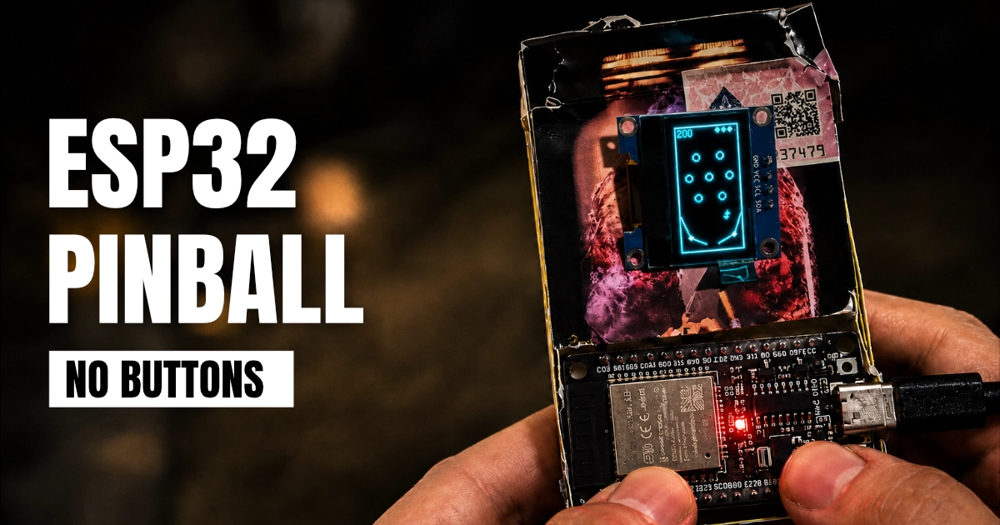

# ESP32 Pinball



A pinball game built from scratch for the ESP32 microcontroller, rendered on a 128x64 OLED display and controlled with capacitive touch pads. No game engine, no frameworks, just C++ and physics.

[Watch the build video on YouTube](https://www.youtube.com/watch?v=_fYJRqrt3yo)

## What This Is

A fully playable pinball game running on an ESP32 with a tiny monochrome OLED screen. The game features real-time ball physics with gravity and friction, two flippers controlled by touch input, seven bumpers that score points on hit, guide walls that funnel the ball toward the flippers, and a title screen, score tracking, and game-over flow.

Everything runs at 30 FPS on the microcontroller. The physics use adaptive sub-stepping to prevent the ball from tunneling through objects at high speed.

## Hardware

You need three things: an ESP32 dev board (DOIT DevKit V1 or similar), an SSD1306 128x64 I2C OLED display, and two bare wire pads or foil strips for the touch input.

The OLED connects over I2C (SDA on GPIO 21, SCL on GPIO 22). The touch pads use the ESP32's built-in capacitive touch pins. No buttons, no mechanical parts for input. Just touch.

Full wiring details and pin assignments are in [ARDUINO_SETUP.md](ARDUINO_SETUP.md).

## Building

### PlatformIO (recommended)

```bash
platformio run              # Build
platformio run -t upload    # Flash to board
platformio device monitor   # Serial output
```

### Arduino IDE

Install the ESP32 board package and the Adafruit SSD1306 + GFX libraries, then follow the steps in [ARDUINO_SETUP.md](ARDUINO_SETUP.md).

### Desktop (no hardware needed)

You can build and run the game engine on your computer for testing. It renders to the terminal:

```bash
mkdir build && cd build
cmake ..
make
./pinball_test
```

## Controls

Touch any flipper pad to start the game from the title screen.

The left flipper is wired to touch pins T8 (GPIO 33) and T9 (GPIO 32). The right flipper uses T4 (GPIO 4), T5, T6, and T7. Touching any pad on a side activates that flipper. The same touch input restarts the game after a game over.

The desktop build (`./pinball_test`) runs an automated simulation and does not accept keyboard input.

## How It Works

The game uses a vertical coordinate system (64 wide, 128 tall) that maps to the OLED mounted in portrait orientation. The display buffer is a 1024-byte monochrome bitmap. All drawing (lines, circles, rectangles, text) is done with custom routines, no external graphics library at the game level.

The physics loop runs per-frame with variable delta time. Ball movement uses velocity-based integration with gravity pulling downward and friction dampening each frame. Collision detection handles circle-to-line (flippers, walls) and circle-to-circle (bumpers) intersections, with reflection and impulse forces applied on contact. When a flipper is active, it adds an upward kick to the ball on hit.

The code is split into focused modules:

| File            | Purpose                                           |
| --------------- | ------------------------------------------------- |
| `game_engine`   | Game loop, state machine, collision orchestration |
| `graphics`      | Pixel buffer, drawing primitives, text rendering  |
| `ball`          | Position, velocity, gravity, boundary checks      |
| `flipper`       | Rotating rods with collision and impulse          |
| `bumper`        | Circular obstacles with scoring                   |
| `wall`          | Guide rail collision                              |
| `input_handler` | ESP32 capacitive touch reading                    |

## Project Status

This is a working prototype. The core gameplay loop is solid and playable.

## About

Built by [Sander de Snaijer](https://www.sanderdesnaijer.com). This is one of several hardware and software side projects. Check out the [projects page](https://www.sanderdesnaijer.com/projects) for more, or the [blog](https://www.sanderdesnaijer.com/blog) for write-ups on how things are built.

<!-- TODO: Link to dedicated blog post / project page when published -->

## License

[MIT](LICENSE)
